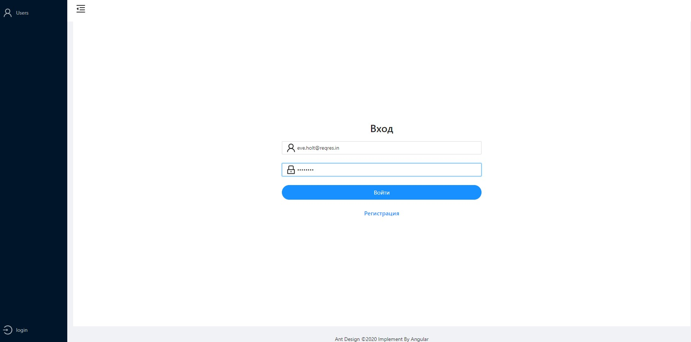
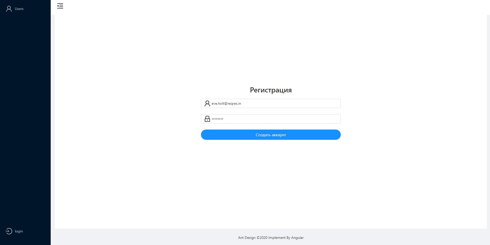
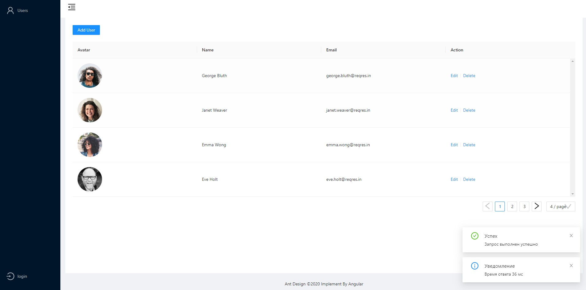
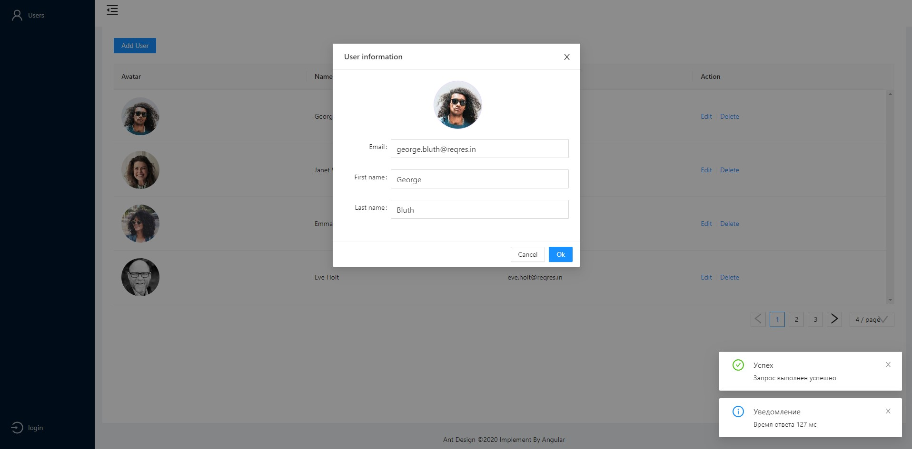
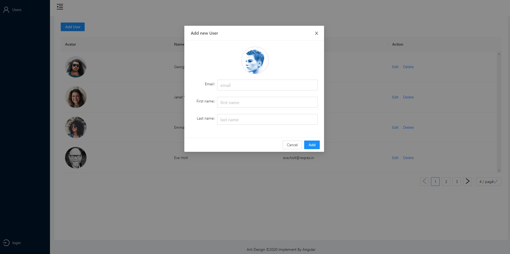
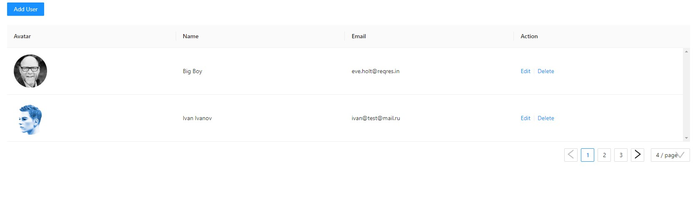

# Тестовое задание
## Введение
Проект был реализован с помощью набора UI-компонентов `Ng-Zorro`, фреймворка `Angular` и тестового сервиса [reqres.in](https://reqres.in/). Генерация документации происходит с помощью инструмента `Compodoc`.
Cтарался придерживаться style guide **AirBnB** и **Google TypeScript**.
### [Demo](https://alibektaymamatov.github.io/AtonTestCase/users)
Ниже описана тестовая задача, а также условия её реализации.
## Задача

1. Создать форму для регистрации и аутентификации
пользователя;
2. Закрыть возможность любого действия, если пользователь не
авторизован;
3. Сверстать таблицу или использовать готовую компоненту из
UI библиотек `Ng-Zorro`, `Material`, `Bootstrap 4+` (или любой
другой);
4. Наполнить таблицу данными, которые поступают через API;
5. Реализовать серверную пагинацию для таблицы;
6. Разработать страницу с кнопкой создания объекта, которая
открывает форму в модальном окне. После создания объекта,
необходимо отобразить его на этой же странице и показать
кнопки редактирования и удаления. Редактирование должно
открывать модальное окно с формой редактирования текущего
объекта. Кнопка удаления удаляет объект. Все действия должны
происходить без перезагрузки;
7. Создать систему оповещений об ответах сервера (на основе
статуса HTTP ответа выводить сообщение для пользователя;
например: “Данные получены за N секунд”, “Данные сохранены.
ID: 356”, “Данные обновлены”, “Данные удалены”);
## Условия

### Вёрстка
1. Первая строка таблицы (заголовок) должна быть привязана и
оставаться на месте при прокрутке таблицы;
2. При загрузке данных с сервера должен быть loader;
3. Оповещения должны быть в виде небольших окошек в углу
окна браузера. Оповещения должны автоматически скрываться
по истечению 5 секунд или при клике по ним. Оповещений
может быть несколько сразу.
### Код
1. Приветствуется использование фреймворков в следующем
порядке: `Angular`, `Vue` или `React`;
2. Может быть использован любой из следующих языков:
`TypeScript`, `JavaScript`;
3. Приложение должно использовать npm (либо аналогичный
пакетный менеджер) для установки требуемых пакетов;
4. Приложение должно быть объектно-ориентированным;
5. Код должен быть полностью покрыт комментариями;
6. При разработке необходимо использовать `Git`;
7. Должен быть создан и наполнен файл README.md, с
описанием проекта, инструкцией запуска;
8. Необходимо использовать любой из стандартов `code style`
(используемый указать в README);

## Результат работы

### Запуск проекта
>#### Установка и обновление зависимостей
Выполнить команду `npm install`
>#### Старт проекта
Выполнить команду  `npm start`

Тестовые данные для входа и регистрации:

email: `eve.holt@reqres.in`

password: `pistol`
>#### Посмотреть документацию
Выполнить команду `compodoc -s -o`
## Скрины работы приложения

